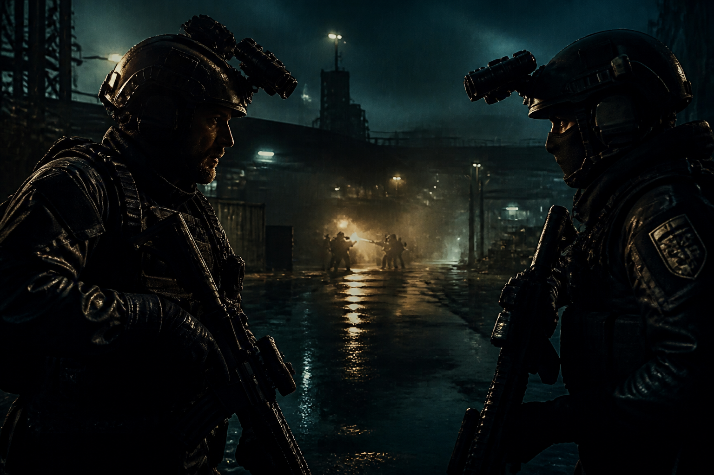

# Dual Fire

**Kill to survive.** A solo-vs-AI tactical FPS you play in the browser.

[Play the demo](https://mohammadrefayethossainmina.github.io/demo-multiplayer-games/) · [How to start](HOW-TO-START-PLAYING.md) · [Project spec](PROJECT_SPEC.md)

<p align="center">
  
</p>

You drop into **Freehold Lane** alone. Hostile AI soldiers hunt you. **Kill the boss to win.** Nobody respawns. There is no second human player in this build — the repository name is leftover from an earlier plan.

---

## Play

1. Open the [live site](https://mohammadrefayethossainmina.github.io/demo-multiplayer-games/).
2. Click **Play Demo**, then **Enter Freehold Lane**.
3. Click **Start match**, then click the game so the mouse locks.

Default kit only: rifle, CQC, pistol. No unlocks and no paid skins.

| | |
| --- | --- |
| Mode | Solo vs AI (PvE) |
| Win | Kill the boss |
| Map | Freehold Lane |
| Tournament | Inactive (no prize, no signup) |

---

## On the landing page

The GitHub Pages site is an interactive briefing, not a static flyer:

- **Play Demo** opens an ops overlay, then sends you into the match
- **Loadout** thumbnails swap the issued rifle, CQC, and pistol
- **Intel** cards expand the sector story
- **Views** saves operator feedback in the browser (`localStorage` only)

---

## Controls

| Input | Action |
| --- | --- |
| `W` `A` `S` `D` | Move |
| Mouse | Look |
| Left mouse | Fire |
| Mouse wheel | Next / previous weapon |
| `R` | Reload |
| `1` `2` `3` | ACR / CQC / Pistol |
| `Space` | Jump |
| `Shift` | Sprint |
| `Esc` | Unlock mouse / pause |

---

## Stack

| Layer | Tech |
| --- | --- |
| Landing page | HTML, CSS, JavaScript |
| Match | Three.js (WebGL) via Vite |
| Hosting | GitHub Pages (`dist/` from `.github/workflows/pages.yml`) |

Commercial flags in `src/config/Commercial.js` stay **off**. Demo 3D is Kenney art and must be replaced before a paid launch — see [ASSETS-DEMO.md](ASSETS-DEMO.md).

---

## Run locally

Need **Node.js** (match) and **Python 3** (landing page). Full walkthrough: [How to start playing](HOW-TO-START-PLAYING.md).

```bash
npm install
npm run dev
```

In a second terminal:

```bash
python -m http.server 8765 --bind 127.0.0.1
```

Open http://127.0.0.1:8765/ → **Play Demo** → **Enter Freehold Lane**.

The match also runs on its own at http://127.0.0.1:5173/.

---

## Docs

| File | What it covers |
| --- | --- |
| [HOW-TO-START-PLAYING.md](HOW-TO-START-PLAYING.md) | Play on the live site or on your machine |
| [PROJECT_SPEC.md](PROJECT_SPEC.md) | Brief, architecture, commercial flags |
| [PRE-GAME-CHECK.md](PRE-GAME-CHECK.md) | Pre-play checklist |
| [ATTENTION.md](ATTENTION.md) | Image and commercial notes |
| [ASSETS-DEMO.md](ASSETS-DEMO.md) | Demo 3D that must be replaced |
